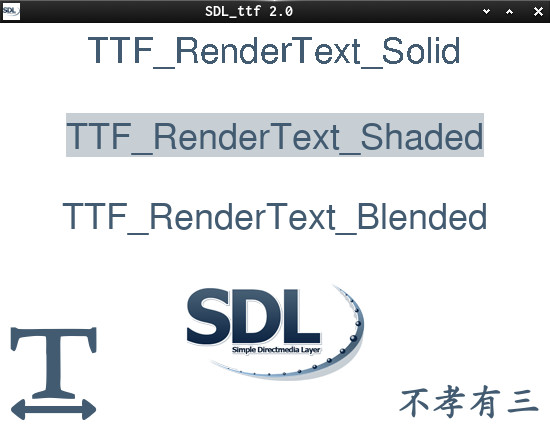
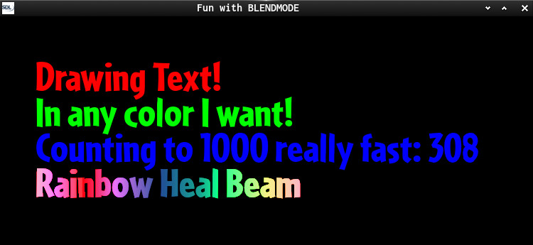
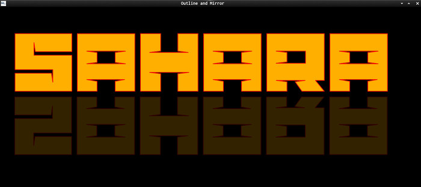
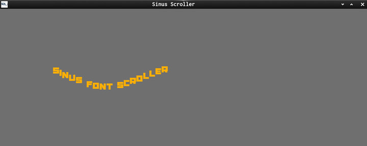

This is a C-SDL2 series about the SDL-Extension SDL_ttf 2.0

It does demonstrate how...  

  * init and build
  * load and draw Fonts
  * use solid, shaded, blended calls
  * UTF8_Blended, Glyph_Blended
  * having fun with TextureBlendMode
  * render text mirrored and outlined
  * make a sinus scroller
  

Useful links:  
[SDL2](https://www.libsdl.org/) | [SDL-Discourse](https://discourse.libsdl.org) | 
[SDL_ttf 2.0](https://www.libsdl.org/projects/SDL_ttf/) | [More SDL2 Example Code](https://gist.github.com/Acry/baa861b8e370c6eddbb18519c487d9d8)  

Screenshots:  

[Get in touch on SDL-Discourse](https://discourse.libsdl.org/u/Acry/summary)
